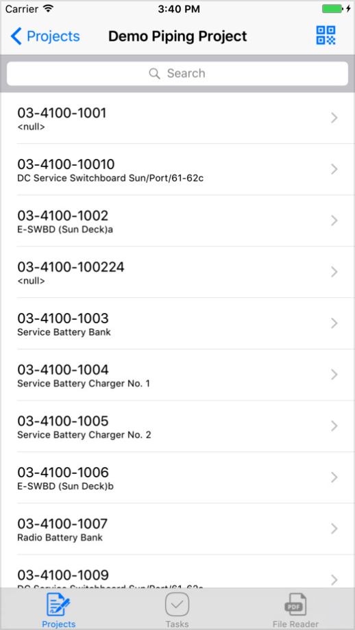
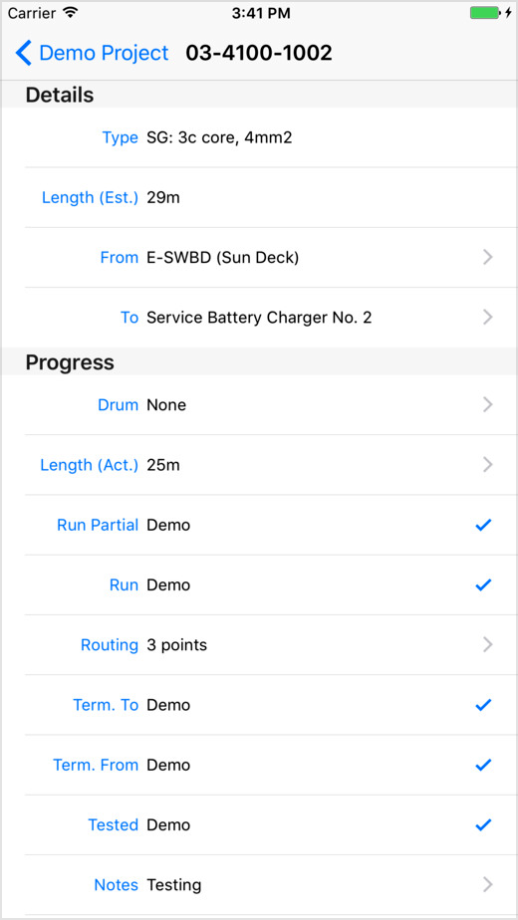
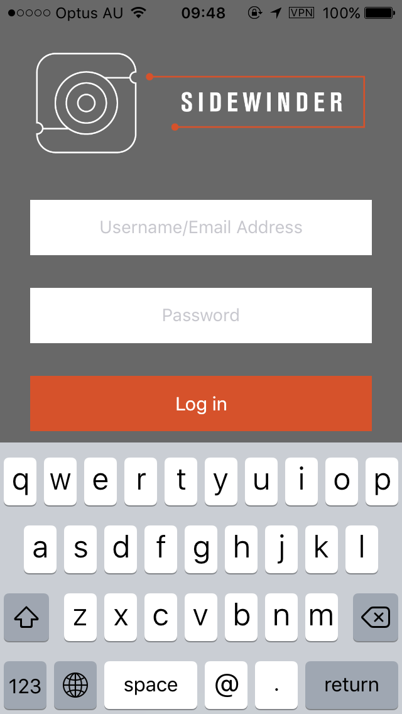
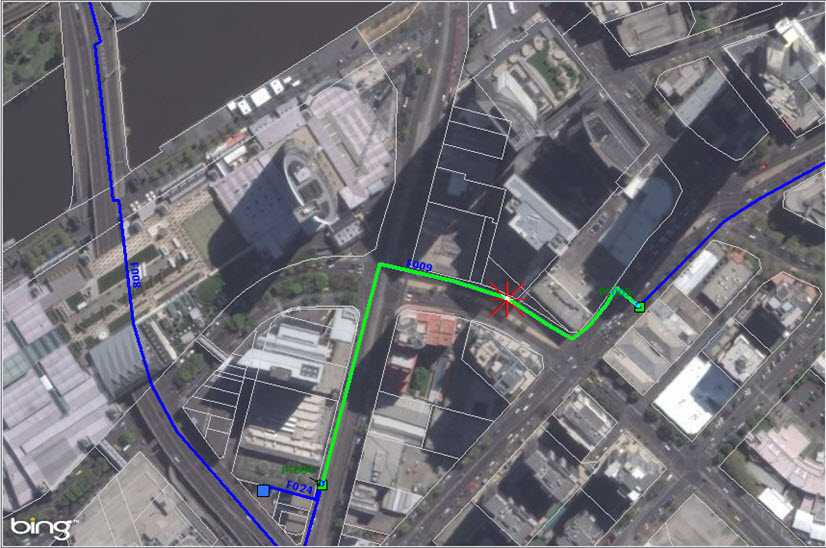
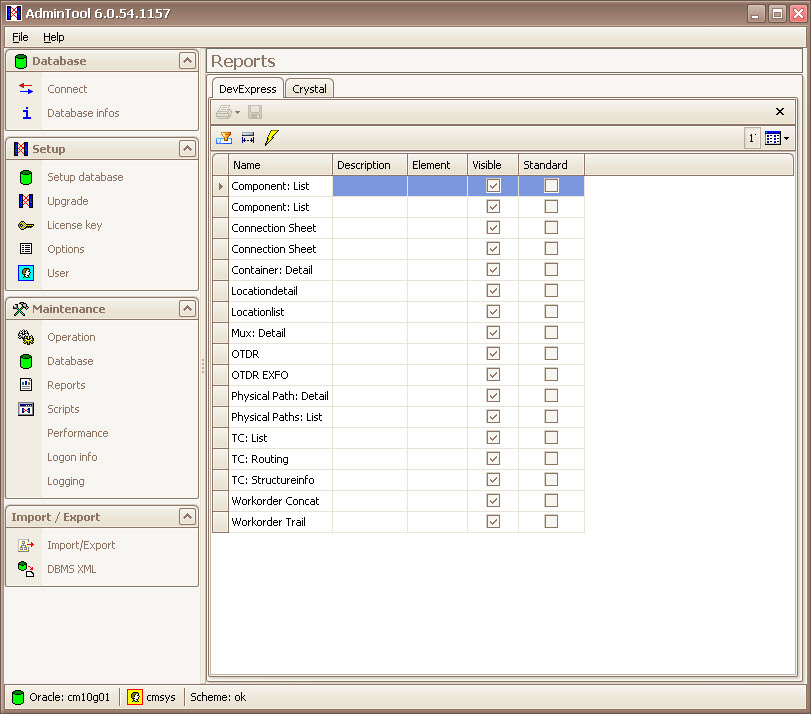
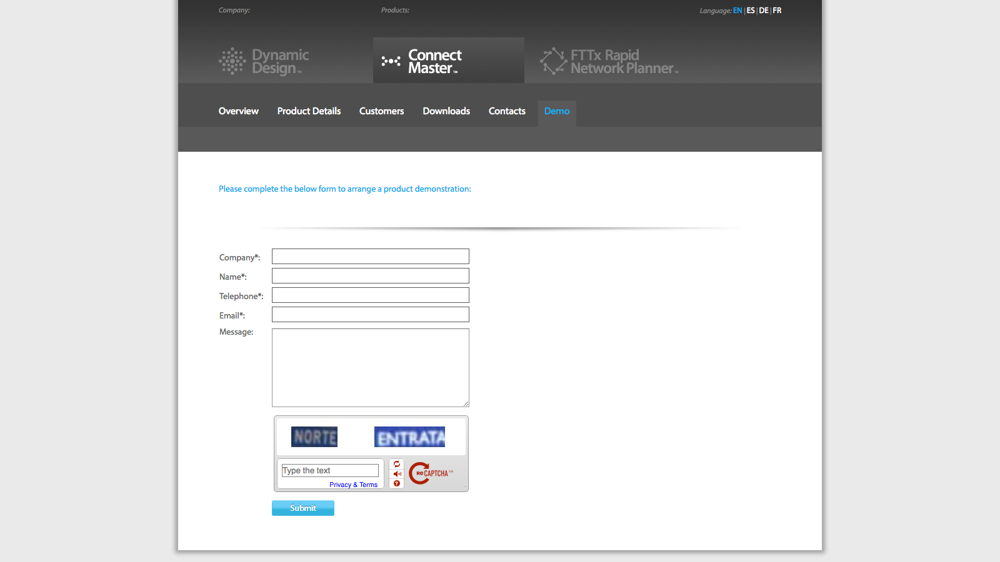
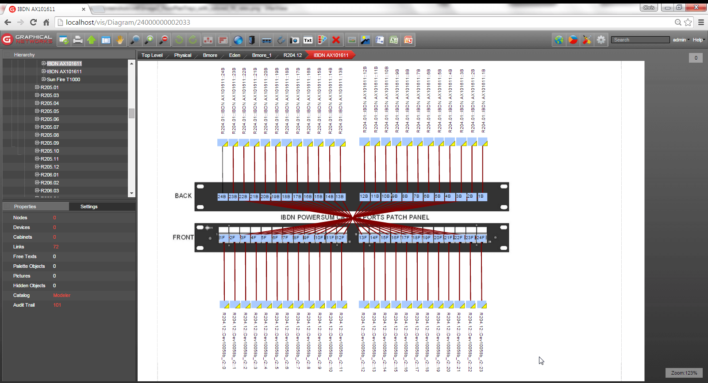
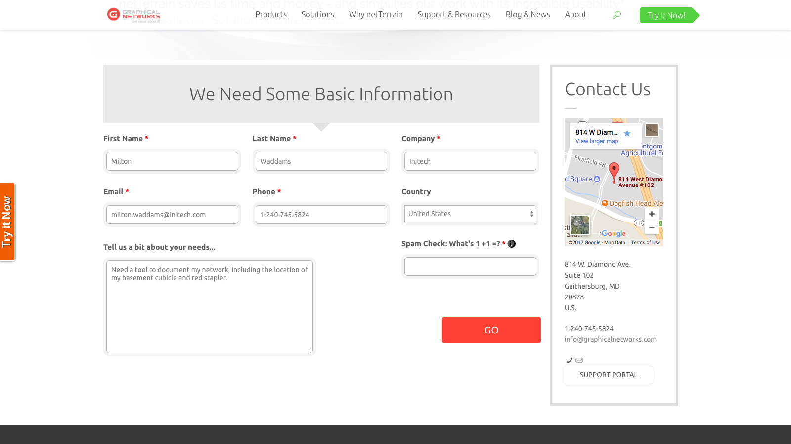
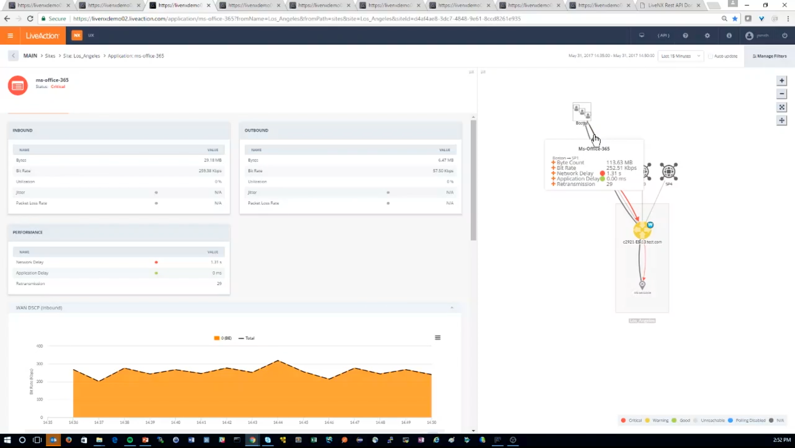
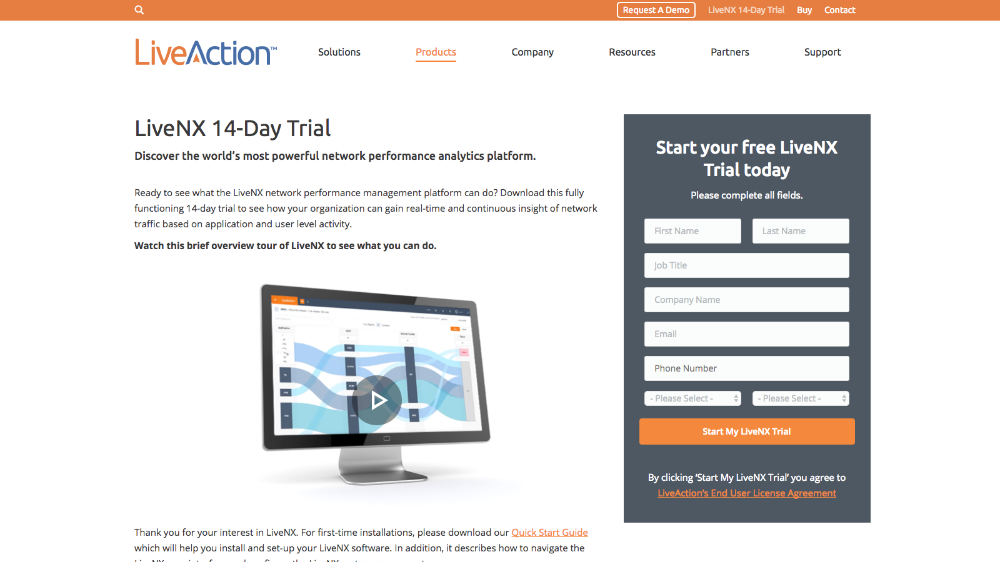

# PatchMan Proposal

#### Roan Atkinson and James Greatbanks

---

### Problem Analysis

---

Don't lie. Cable management is a pain, and it always has been. You always tell yourself when you're configuring your setup that this time, *this time*, you'll organize the cables.

But they always seem to end up in one big tangled cluster behind your setup. This makes moving and/or changing any part of the setup incredibly difficult as it becomes difficult to determine which cable is which, and what their respective I/O is.

There are attempts at physical management solutions to solve the problem of cable management, like as labeling your cables and using identifiers/other parameters like color.

However, these miss the root cause of the problem of cable management. You need a consistent and reliable way to track and log all of your cables. All the inputs and outputs, and any other identifying characteristics, such as color and type of cable.

This is an issue to anyone who has their own setup, and even more so a major issue to those who have to manage much larger and comprehensive setups, such as system administrators.

PatchMan seeks to remedy this issue through a comprehensive but basic method of itemizing cables and adding additional descriptive parameters to suit each and every setup, and the necessary means to organize and maintain a consistent setup.

---

### Existing Solutions

---

1) **Sidewinder** - Cable Installation Management

Sidewinder is an application for iOS devices running iOS 10 and up. The application appears to be very similar to our initial concept, being based on a set of table views and it is based around assisting with cable management.

From the screenshots available, the application appears to have a lot of parameters available for each cable, along with a way to sync setups with other network administrators/cabling staff.

However, when we attempted to open this application on our phones, Sidewinder requested credentials. There is no visible way to make an account or request an account on the login screen, and we were barred from the application.

---

2) **Connect Master™** - Physical Resource Management

Connect Master™ appears to be a web application for managing very large and significant cabling networks/setups that will usually contain underground cabling and cover multiple datacenters.

This application appears to be on a much more broad scale than we intend to put PatchMan on. Even though we intend to use Core Data and share the setups with others via CloudKit, setup managers/cable staff of this magnitude of setup are not our target audience.

It is difficult to gauge how we could incorporate features of this application into ours, because there is no distinct way to get a trial or demo of the application. All applications for a demo or trial are via email, and there is no trial/downloadable version that is readily available.

---

3) **netTerrain** - Cable and Circuit Management DCIM Software

netTerrain appears to be very similar to Connect Master, being a primarily graphical and large-scale software for the purpose of wide-scale management, on top of being a web application.

This is on a considerably larger than PatchMan is intended to be, and is aimed at corporations/companies, rather than smaller scale, personal setups and more minor setups.

This software runs into the problem of us not being able to actually access the software, because to request a trial, it appears that you need to provide evidence that you are a part of a company that will actually use the product and the software is not easily or freely accessible.

---

4) **LiveNX** - Network Performance Management

This application appears to be a natively written application for Windows, but it is difficult to determine what platforms LiveNX is available on, because in another video on the site, it states that LiveNX comes with a scaleable web application.

This application also runs into the issue of not having an openly accessible demo version of the application, meaning we're just relying on the screenshots and descriptions.

---

### Common Themes and Potential Improvements

---

A common pitfall between all of these applications is the inability of their being a truly accessible application that anyone can pick up and install freely and openly.

Everything we've found is either behind an application form for a demo or is simply inaccessible to the wider public without being a member of a company or organization with the authority to use and attain the product on behalf of the company. There doesn't seem to be a simple and openly available application on any platform that will actually help you with cable I/O and management.

We believe this is where the space is in the market for cable management applications, and we can avoid these pitfalls in order to create a functional and accessible application.
